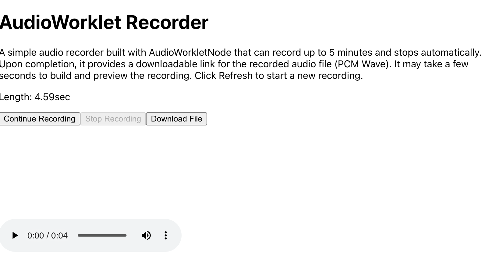

#audio-recorder-js

A JavaScript library for audio recording, based on the [GoogleChromeLabs Web Audio Samples project](https://github.com/GoogleChromeLabs/web-audio-samples/tree/main/src/audio-worklet/migration/worklet-recorder).


## Installation

Install using npm:
```sh
npm install @lanesky/audio-recorder-js
```

## IMPORTANT
This library currently works only on Chrome. Support for other browsers may be added in future updates.

## Usage

Below is an example of how to use the library in a React hook.


### Step 1 - create a hook.

Create a custom hook for audio recording:

```
// hooks/useAudioRecorder.ts

import { useEffect, useRef, useState } from "react";

import { AudioRecorder } from "@lanesky/audio-recorder-js"

const useAudioRecorder = (createVisualizers: (analyserNode: AnalyserNode) => (unknown)[], workletNodeProcessorUrl =  './recording-processor.js') => {
  const audioRecorderRef = useRef<AudioRecorder | null>(null);
  const [dataLen, setDataLen] = useState("0");
    const [isInitialized, setIsInitialized] = useState(false);
    const [isMaxLenReached, setIsMaxLenReached] = useState(false);
  const [isRecording, setIsRecording] = useState(false);
    const [audioFileUrl, setAudioFileUrl] = useState("");


  
  useEffect(() => {
      const audioRecorder = new AudioRecorder(workletNodeProcessorUrl);
      audioRecorder.onCreateVisualizers = createVisualizers;

    audioRecorder.onRecordingLengthUpdated = (len:string) => {
      setDataLen(len);
    };

      audioRecorder.onRecordingStateChanged = (isRecording:boolean) => {
      setIsRecording(isRecording);
    };

    audioRecorder.onRecordingMaxLenReached = () => {
      setIsMaxLenReached(true);
    };

    audioRecorder.onDownloadReady = (url:string) => {
      setAudioFileUrl(url);
    };
      

    audioRecorderRef.current = audioRecorder;

    return () => {
      // Optional cleanup method if needed
      audioRecorderRef.current?.cleanup();
    };
  }, [createVisualizers, workletNodeProcessorUrl]);

  const startRecording = () => {
    if (audioRecorderRef.current) {
      if (!audioRecorderRef.current.isInitialized()) {
          audioRecorderRef.current.initContext();
          setIsInitialized(true);
        
      } else {
        audioRecorderRef.current.startRecording();
      }
    }
  };

  const stopRecording = () => {
    if (audioRecorderRef.current) {
      audioRecorderRef.current.stopRecording();
    }
  };

  return {
      dataLen,
      isInitialized,
    isRecording,
    isMaxLenReached,
    audioFileUrl,
    startRecording,
    stopRecording,
  };
};

export default useAudioRecorder;

```

### Step 2 - Use the Hook

Use the custom hook in your component:

```
//App.tsx

import React, { useCallback } from "react";
import logo from "./logo.svg";
import "./App.css";
import useAudioRecorder from "./hooks/useAudioRecorder";

function App() {
  const createVisualizers = useCallback((analyserNode: AnalyserNode) => {
    return [];
  }, []);
  const {
    dataLen,
    isInitialized,
    isRecording,
    isMaxLenReached,
    audioFileUrl,
    startRecording,
    stopRecording,
  } = useAudioRecorder(createVisualizers, "./recording-processor.js");

  const recordText = isMaxLenReached
    ? "Reached the maximum length of"
    : isInitialized
    ? "Continue"
    : "Start";

  return (
    <main className="relative min-h-screen bg-white sm:flex sm:items-center sm:justify-center">
      <div className="mx-auto max-w-7xl px-4 py-2 sm:px-6 lg:px-8">
        <h1>AudioWorklet Recorder</h1>
        <p>
          A simple audio recorder built with AudioWorkletNode that can record up
          to 5 minutes and stops automatically. Upon completion, it provides a
          downloadable link for the recorded audio file (PCM Wave). It may take
          a few seconds to build and preview the recording. Click Refresh to
          start a new recording.
        </p>

        <div className="demo-box">
          <div id="recording">
            <div>
              <p>
                Length: <span id="data-len">{dataLen}</span>
                sec
              </p>
              <button
                onClick={startRecording}
                disabled={isRecording}
                id="record"
              >
                <span id="record-text">{recordText}</span> Recording
              </button>
              <button onClick={stopRecording} disabled={!isRecording} id="stop">
                Stop Recording
              </button>
              <a id="download-link" href={audioFileUrl}>
                <button disabled={isRecording} id="download-button">
                  Download File
                </button>
              </a>
            </div>

            <div className="recording-display">
              <canvas id="recording-canvas"></canvas>
              <canvas id="vu-meter"></canvas>
            </div>

            <audio
              src={audioFileUrl}
              id="player"
              className="w-full"
              controls
            ></audio>
          </div>
        </div>
      </div>
    </main>
  );
}

export default App;
```



## Notes

### recording-processor.js

Place the recording-processor.js file somewhere accessible to the worklet context. By default, it should be under the public folder, but you can place it elsewhere. If so, specify the path explicitly when initiating the AudioRecorder instance:

```
const useAudioRecorder = (createVisualizers: (analyserNode: AnalyserNode) => (unknown)[], workletNodeProcessorUrl =  './recording-processor.js') => {
...
....
}
```